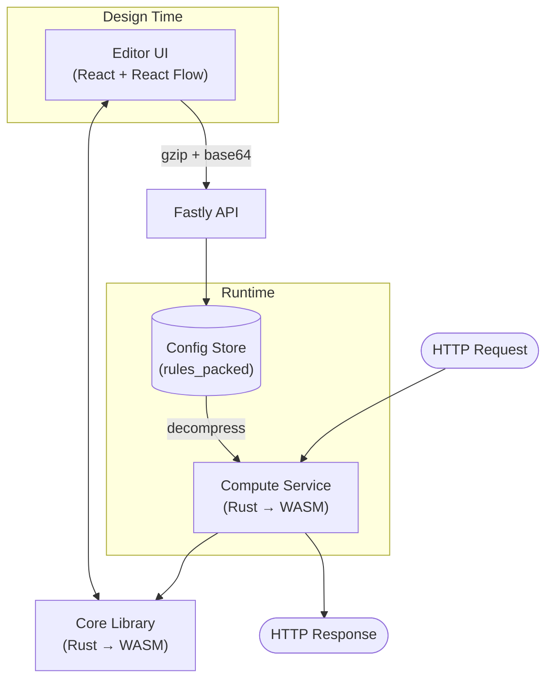
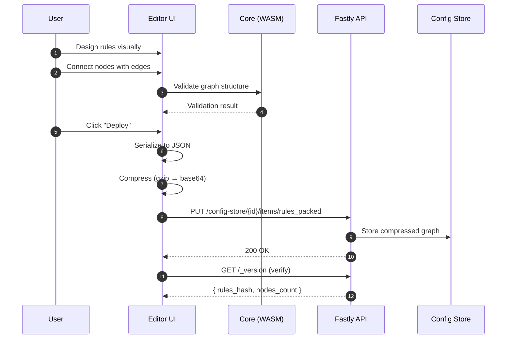
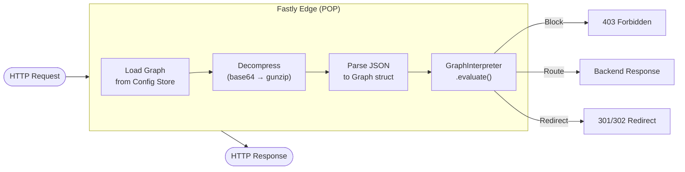
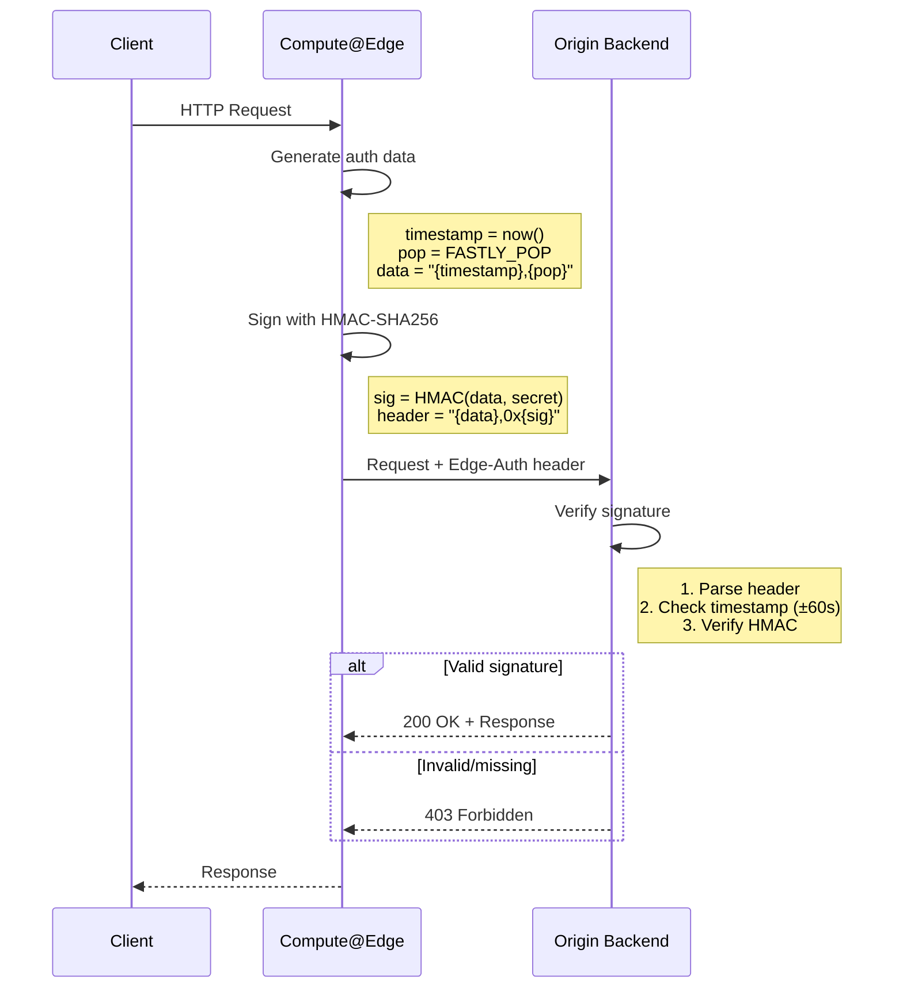

# Architecture

Configure Compute (CC) is a visual node-based security rules editor and runtime for Fastly Compute@Edge. It enables designing edge security policies through a graphical interface without writing code.

> For setup and usage instructions, see [README.md](README.md).

---

## System Overview



The system consists of three components that share a common JSON graph format:

| Component | Location | Technology | Purpose |
|-----------|----------|------------|---------|
| **Editor UI** | `/editor-ui` | React 19, React Flow, TypeScript | Visual graph designer |
| **Core Library** | `/core` | Rust → WASM | Shared types, validation |
| **Compute Service** | `/compute` | Rust → WASM | Edge request processing |

---

## Directory Structure

```
visual-compute-engine/
├── editor-ui/                 # React frontend
│   ├── src/
│   │   ├── nodes/             # Node type components
│   │   │   ├── RequestNode.tsx
│   │   │   ├── RuleGroupNode.tsx
│   │   │   ├── ConditionNode.tsx
│   │   │   ├── ActionNode.tsx
│   │   │   ├── BackendNode.tsx
│   │   │   ├── HeaderNode.tsx
│   │   │   ├── CacheNode.tsx
│   │   │   ├── RateLimitNode.tsx
│   │   │   ├── TransformNode.tsx
│   │   │   └── RedirectNode.tsx
│   │   ├── components/        # Sidebar, panels, toolbar
│   │   ├── hooks/             # useDeployment, useGraphState
│   │   ├── Flow.tsx           # Main canvas orchestrator
│   │   └── main.tsx           # Entry point
│   └── vite.config.ts
│
├── compute/                   # Rust edge service
│   ├── src/
│   │   ├── main.rs            # Entry point, HTTP handler
│   │   ├── interpreter.rs     # Graph traversal engine
│   │   ├── graph.rs           # Node/Edge types, deserialization
│   │   ├── backend.rs         # BackendBuilder configuration
│   │   ├── edge_auth.rs       # HMAC-SHA256 signing
│   │   └── logging.rs         # WAF logs with UUIDv7
│   ├── fastly.toml            # Service configuration
│   └── Cargo.toml
│
├── core/                      # Shared WASM library
│   ├── src/
│   │   └── lib.rs             # Graph types + WASM bindings
│   └── Cargo.toml
│
└── Makefile                   # Build commands
```

---

## Data Flow

### Design & Deployment



### Request Processing



---

## Node Reference

| Node | Type | Handles | Description |
|------|------|---------|-------------|
| **Request** | Entry | `out` | Graph entry point, one per graph |
| **RuleGroup** | Decision | `in`, `match`, `noMatch` | Evaluates multiple conditions with AND/OR logic |
| **Condition** | Decision | `in`, `true`, `false` | Evaluates single condition |
| **RateLimit** | Decision | `in`, `ok`, `exceeded` | Checks request rate against limits |
| **Header** | Modifier | `in`, `out` | Modifies request headers (set/append/remove) |
| **Cache** | Modifier | `in`, `out` | Sets cache TTL, SWR, surrogate keys |
| **Transform** | Modifier | `in`, `out` | Transforms values, stores in variables |
| **Action** | Terminal | `in` | Returns response (block/allow/challenge) |
| **Backend** | Terminal | `in` | Routes request to origin backend |
| **Redirect** | Terminal | `in` | Returns HTTP redirect (301/302) |

### Condition Operators

| Operator | Description | Example |
|----------|-------------|---------|
| `equals` | Exact match | `path equals "/admin"` |
| `startsWith` | Prefix match | `path startsWith "/api/"` |
| `endsWith` | Suffix match | `path endsWith ".json"` |
| `contains` | Substring match | `userAgent contains "bot"` |
| `matches` | Regex match | `path matches "^/v[0-9]+/"` |
| `in` | Value in list | `method in ["POST", "PUT"]` |
| `notIn` | Value not in list | `country notIn ["XX", "YY"]` |
| `inCidr` | IP in CIDR range | `clientIp inCidr "10.0.0.0/8"` |

### Available Fields

| Field | Description |
|-------|-------------|
| `path` | Request URL path |
| `method` | HTTP method (GET, POST, etc.) |
| `host` | Host header value |
| `clientIp` | Client IP address |
| `userAgent` | User-Agent header |
| `country` | Geo-IP country code |
| `asn` | Autonomous System Number |
| `deviceType` | Device type (desktop, mobile, tablet) |
| `deviceBrand` | Device brand |
| `ja3` | TLS fingerprint (JA3) |
| `ja4` | TLS fingerprint (JA4) |
| `header` | Custom header (specify `headerName`) |

---

## Security Architecture

### Edge Authentication

Prevents attackers from bypassing edge rules by calling backends directly.



**Header Format:** `{timestamp},{pop},0x{hmac_hex}`

Example: `1705612800,LAX,0x8a3b4c5d6e7f...`

### Fail-Open Strategy

The system is designed to fail open - errors in rule evaluation never silently block legitimate traffic:

| Scenario | Behavior |
|----------|----------|
| Config Store unavailable | Return 503 with error details |
| Graph parse error | Return 503 with error details |
| Condition evaluation error | Treat as non-match, continue |
| Rate limit lookup fails | Allow request (fail open) |
| Backend unreachable | Return 503, log error |

---

## Data Formats

### Graph JSON Schema

```json
{
  "nodes": [
    {
      "id": "node_1",
      "type": "request",
      "position": { "x": 100, "y": 100 },
      "data": {}
    },
    {
      "id": "node_2",
      "type": "ruleGroup",
      "position": { "x": 300, "y": 100 },
      "data": {
        "conditions": [
          {
            "field": "path",
            "operator": "startsWith",
            "value": "/api/"
          }
        ],
        "logic": "AND"
      }
    },
    {
      "id": "node_3",
      "type": "action",
      "position": { "x": 500, "y": 50 },
      "data": {
        "action": "block",
        "statusCode": 403,
        "message": "Forbidden"
      }
    }
  ],
  "edges": [
    {
      "id": "edge_1",
      "source": "node_1",
      "target": "node_2"
    },
    {
      "id": "edge_2",
      "source": "node_2",
      "target": "node_3",
      "sourceHandle": "match"
    }
  ]
}
```

### Compression Format

```
┌─────────────────────────────────────────────────────┐
│                  Compressed Format                   │
├─────────────────────────────────────────────────────┤
│  base64( gzip( JSON.stringify(graph) ) )            │
│                                                     │
│  Example: "H4sIAAAAAAAAA6tWKkktLlGyUlAqS8wpTtVR..."  │
├─────────────────────────────────────────────────────┤
│                 Uncompressed Format                  │
├─────────────────────────────────────────────────────┤
│  "raw:" + base64( JSON.stringify(graph) )           │
│                                                     │
│  Example: "raw:eyJub2RlcyI6W3siaWQiOiIxIiwidHlw..."  │
└─────────────────────────────────────────────────────┘
```

Compression achieves ~80% size reduction for typical graphs.

### Config Store Keys

| Key | Description |
|-----|-------------|
| `rules_packed` | Compressed graph (gzip+base64 or raw:base64) |
| `compute_auth_key` | HMAC secret for edge authentication |

---

## Key Design Decisions

| Decision | Rationale |
|----------|-----------|
| **Single JSON format** | No transpilation between editor and runtime eliminates conversion bugs and enables instant deployment |
| **Fail-open on errors** | Security rules should never accidentally block legitimate traffic; errors surface visibly as 503s |
| **WASM for validation** | Share Rust types between runtime and UI; validate graphs client-side before deployment |
| **gzip compression** | Reduce Config Store payload size; faster edge loading |
| **React Flow for UI** | Mature node graph library with good DX; similar UX to Unreal Blueprints |
| **Accumulator pattern** | Collect header/cache mods during traversal; apply atomically before routing |
| **UUIDv7 for request IDs** | Sortable by time, globally unique, better for log analysis |
| **Edge auth via HMAC** | Simple, fast verification; no network calls needed at backend |

---

## Development

```bash
# Full local development (UI + API + Compute)
make local

# Editor UI only (http://localhost:5173)
make ui

# Compute service only (Viceroy local runtime)
make serve

# Build WASM binary
make build

# Run tests
cargo test --lib              # Rust unit tests
node test-graphs.mjs          # Integration tests
```

### Deployment Verification

```bash
# Check deployed version and rules hash
curl -s https://your-service.edgecompute.app/_version | jq

# Response:
{
  "engine": "Configure Compute",
  "version": "1.1.5",
  "rules_hash": "a1b2c3d4",
  "nodes_count": 12,
  "edges_count": 15
}
```
